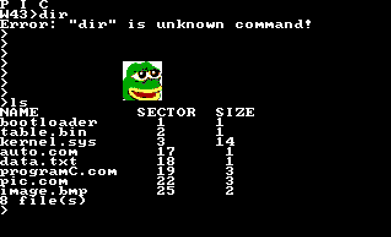

# OS
Simple 16 bit operating system. My goal is to achive:
* errors management
* simple programs (file manager,file editor, games, image viewer)
* user's custom programs execution
* dynamic memory management
* change to protected mode
* protection rings
* multithreading

All sectors in BIOS **are counted from 1** and are 512B\
Screenshot:\

## Commands
| Command     | Description                       |
| :---------- | :-------------------------------- |
| $           | Execute program $.com             |
| cls         | clear screen                      |
| pos         | print cursor position             |
| key         | get keycode                       |
| mode $1     | change video mode to $1           |
| test        | test kernel library               |
| sec $1 $2   | Print $2th sector from $1th track |
| ls          | Print files and their sizes       |
| pic $1      | Draw bitmap from $1 file          |
| touch $1 $2 | Create $1 file with size $2       |
## SYSTEM Interruptions
0x20 is IO int
| AH   | Description               | Parameters            |
| :--- | :------------------------ | :-------------------- |
| 1    | print character on screen | AL - character        |
| 2    | print string on screen    | BX - address ofstring |
| 3    | print integer on screen   | BX - number           |

0x21 is file system int
|  AH   | Description          | BX        | CX                   | DX        | Returns                                  |
| :---: | :------------------- | :-------- | :------------------- | :-------- | :--------------------------------------- |
|   1   | Get file's ID        | file name |                      |           | BX - file ID                             |
|   2   | Reads file to memory | file id   | memory beginning     | size in B | Actually readed Bytes                    |
|   3   | Saves memory to file | file id   | memory beginning     | size in B | Actually saved Bytes (completed to 512B) |
|   4   | Creates file         | file name | new file size in Sec |           | 0 if success                             |
|   4   | Removes BX file      | file name |                      |           | 0 if success                             |

# Program loading and executing
Program is loaded into address (CS+0x1000):0x100.\
Bytes from (CS+0x1000):0 to (CS+0x1000):0xff are reserved for OS i.e:
* 0x00 to 0x08 stores call function to 0x100
* 0x80 to 0xff stores string of program's paramaters

If size of program is $ sectors size, then on $*200+100 bytes is stored automatic return subprogram, it is executed when program don't end on it's own