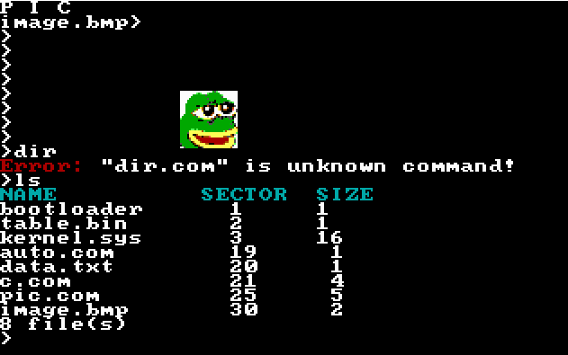

# OS
Simple 16 bit operating system. My goal is to achive:
* errors management
* disk management
* file read/write
* simple programs (file manager,file editor, games, image viewer)
* user's custom programs execution
* dynamic memory management
* change to protected mode
* protection rings
* multithreading

All sectors in BIOS **are counted from 1**\
Screenshot:\

## Commands
| Command        | Description                                                    |
| :------------- | :------------------------------------------------------------- |
| $              | Execute program $.com                                          |
| cls            | clear screen                                                   |
| pos            | print cursor position                                          |
| key            | get keycode                                                    |
| mode $         | change video mode to $                                         |
| test           | test kernel library                                            |
| load $1 $2 $3  | Load $3 size from $1th sector and execute it with parameter $2 |
| sec $          | Print $th sector                                               |
| ls             | Print files and their sizes                                    |
| pic            | Draw bitmap file                                               |
| touch $1 $2 $3 | Create $1 file at $2 sector with size $3                       |
## SYSTEM Interruptions
0x20 is system interruption
| AH   | Description               | Parameters            |
| :--- | :------------------------ | :-------------------- |
| 1    | print character on screen | AL - character        |
| 2    | print string on screen    | BX - address ofstring |
| 3    | print integer on screen   | BX - number           |

0x21 is system interruption
| AH   | Description                                         | Parameters                                                                    |
| :--- | :-------------------------------------------------- | :---------------------------------------------------------------------------- |
| 1    | Returns  AX - begin sector and BX - size in sectors | DX - file name                                                                |
| 2    | Reads CX sectors to DI beginning from SI            | CX - count of sectors, SI beginnig sector, DI - pointer do destination memory |
| 3    | Saves 512 B from SI to DIth sector                  | SI - data pointer to 512B DI - number of sector to save                       |
| 4    | Creates file named SI with size CX in DIth sector   | SI - file name CX - file size DI - sector                                     |

# Program loading and executing
Program is loaded into address 0x2000:0x100.\
Bytes from 0x2000:0 to 0x2000:0xff are reserved for OS i.e:
* 0x00 to 0x08 stores call function to 0x100
* 0x80 to 0xff stores string of program's paramaters

If size of program is $ sectors size, then on $*200+100 bytes is stored automatic return subprogram, it is executed when program don't end on it's own